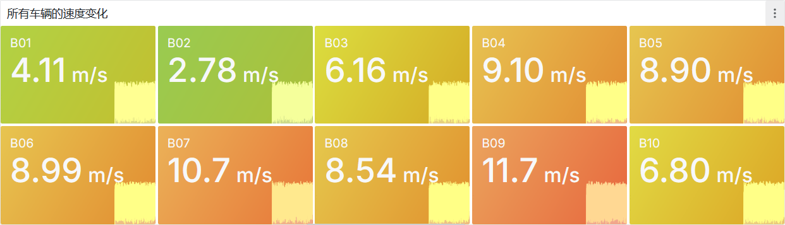
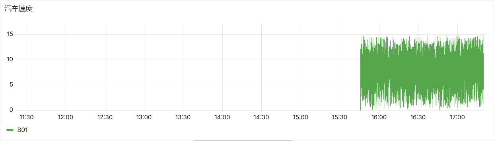
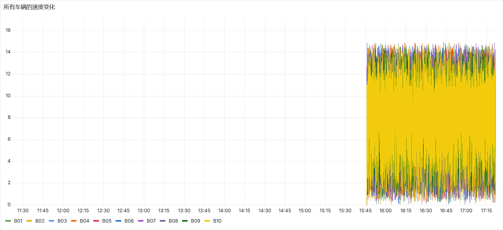
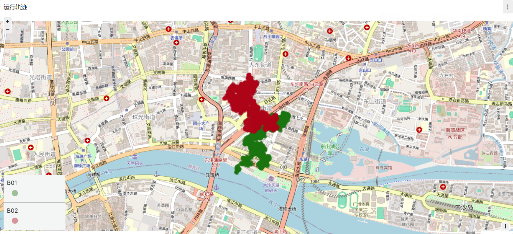
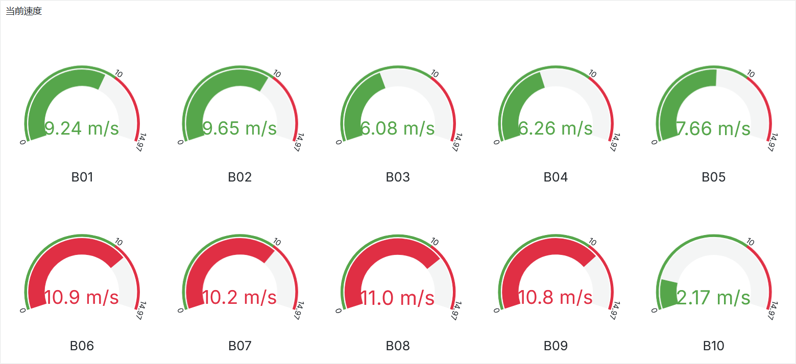

# r1-BDVA
Final Project for the First-Year Master's Course "Big Data Visualization and Analysis"

## Requirements

> Simulate multiple devices, with specific scenarios to be discussed by the group (e.g., vehicles generating data every second). The server receives data via UDP protocol (recommended implementation in Go). Use Kafka as a middleware message queue with basic configurations. Flink acts as a Kafka consumer, processes data, writes to a database, and Grafana visualizes the database data.

## City Bus Real-time Status Monitoring System

### Environment

- Java 17
- Docker
- WSL / Linux distro (tested on Kali Linux)
- Go 1.22.5
- Grafana 11.6.0

### Usage

First run the script:

```shell
./start.sh up
```

Import the `dashboard.json` (file) into Grafana.

Then run the Main.java program under the `flink-consumer` directory.(You may need to modify the path to the jar file.)

### Business Scenario

This system simulates the collection of city bus operational status data (e.g., coordinates, speed, station information) for data collection, cleaning, analysis, and visualization.

### System Architecture

Client -> Server -> Kafka -> Flink -> Database(InfluxDB2) -> Grafana

### Requirements

#### Client-Side Simulation

Simulate collection of bus operational status information, including:

- Longitude
- Latitude
- Speed

Random data generation is acceptable for simulation.

#### Client-to-Server Transmission

Send data in JSON format via UDP protocol.

#### Server-to-Kafka Writing

Write data to Kafka in JSON format.

#### Flink Data Processing

Consume messages from Kafka, deserialize the JSON messages, and write the data into InfluxDB.

#### Grafana Visualization

For example, display:

- Vehicle movement trajectories
- Speed trends over time
- ...

### Visualization Results









